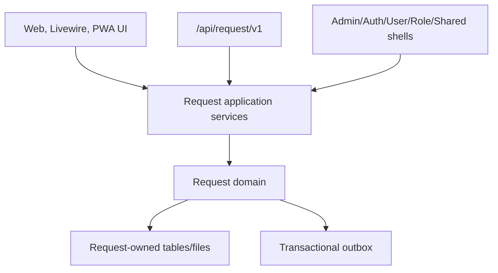
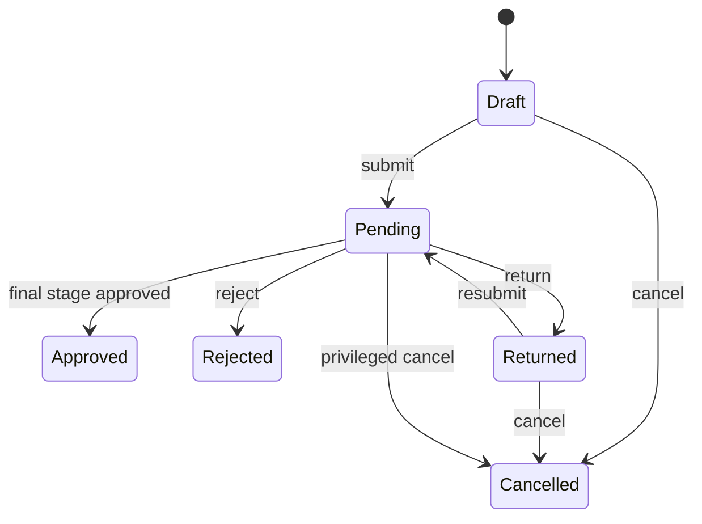

# Request v1 Master Specification

## 1. Product definition

Request is an internal request-and-approval product for one company. It combines a searchable request catalog, versioned dynamic forms, a deterministic approval pipeline, mobile-first employee and approver workspaces, private files, notifications, reports, and immutable audit evidence.

It is deliberately not a general workflow platform. The core promise is simple: an eligible employee can submit a valid request, the correct current users can decide it in the configured order, and every result is explainable after configuration and membership change.

## 2. Success outcomes

- An administrator can publish a safe request type without code.
- A requester can find, complete, submit, and track a request on phone, tablet, desktop, or installed PWA.
- An approver can understand context and decide an assigned task quickly on a phone.
- Sequential, parallel ALL, and parallel ANY approval behave deterministically under retries and concurrency.
- Published definitions and historical runs remain readable and immutable.
- No Request behavior depends on a business-domain module.
- Operators can identify and safely retry delivery failures without re-running business transitions.

## 3. Scope and priority

### Must ship

- Groups, request types, draft/published/retired versions, audience control.
- JSON form schema and server-authoritative validation.
- Draft save, submit, My Requests, detail/timeline, return/edit/resubmit, reject, approve, eligible cancellation.
- Ordered stages with `single`, `parallel_all`, `parallel_any`.
- `fixed_users`, `role_members`, and `form_user_field` resolvers.
- Comments, private attachments, database/in-app plus email notifications.
- RBAC plus record policies, audit, idempotency, optimistic concurrency, outbox.
- Mobile-first creation/inbox/decision; tablet/desktop designer.
- Online-first PWA contract and safe offline drafts/read snapshots.
- Reports and authorized private exports.
- Type definition export and guarded import validation/dry-run; no automatic publication.

### Should ship if the repository capability is ready

- Sanitized PDF/print view and spreadsheet exports through approved shared infrastructure.
- Type-version diff and portable signed/checksummed definition package.
- Queue-backed large exports and delivery notifications.
- Operations screen for outbox, notification, and export failures.

### Explicit future candidates

- Organization/manager resolver, delegation, due dates, SLA, reminders/escalation.
- Conditional stages, count/percentage quorum, collect-all rejection, ad-hoc approvers.
- Graph/BPMN-like runtime, timers, subflows, domain adapters.
- Legal digital signature, multi-company tenancy, fully offline business mutations.
- Realtime broadcasting once a canonical shell contract exists.

## 4. Architectural shape

The arrow from Shell Modules represents use of stable capabilities. There is no arrow to a domain module. UI/controllers/Livewire components orchestrate use cases through application services; state transitions and invariants live in the Request domain; persistence, mail, queue, file, and export adapters sit behind Request-owned application boundaries.

## 5. Core concepts

| Concept | Meaning |
|---|---|
| Request Group | Catalog grouping and display order; no approval behavior |
| Request Type | Stable identity/code and current availability |
| Request Type Version | Immutable published form, policies, audience, and stages |
| Internal Request | Long-lived aggregate with public ID, number, owner, pinned type version, and current status |
| Payload Revision | Immutable normalized/validated form data snapshot |
| Approval Run | One submit or resubmit attempt pinned to a payload revision |
| Stage Definition | Ordered approval rule in a type version |
| Approval Task | Runtime decision unit produced when a stage activates |
| Candidate | User allowed to decide a task, snapshotted at activation |
| Decision | Immutable approve/reject/return action and reason/context |
| Audit Event | Immutable security/business evidence independent of UI timeline copy |

The PHP aggregate/model must be named `InternalRequest` (or another unambiguous Request-owned name approved in `CREATE_PLAN.md`) to avoid collision with `Illuminate\Http\Request`. The canonical table in this specification is `request_instances`.

## 6. Lifecycle summary

Each submit/resubmit creates a new run. A returned request keeps its type version and identifier, while prior payload revisions, runs, tasks, candidates, and decisions remain immutable.

## 7. Approval semantics

Stages are sequential across the pipeline. Parallelism exists only inside a stage:

| Mode | Candidate/task constraint | Completion |
|---|---|---|
| `single` | Exactly one eligible candidate and one task | That task approves |
| `parallel_all` | One task per eligible candidate | All tasks approve |
| `parallel_any` | One task per eligible candidate | First approval; remaining active tasks become skipped |

Reject and return are business outcomes, not graph edges. Reject ends the request. Return ends the current run and lets the requester prepare a new revision. Detailed concurrent behavior is defined in `04-APPROVAL_PIPELINE_AND_DECISIONS.md`.

## 8. Versioning rules

- Request type identity is stable; behavior lives in versions.
- Draft versions are mutable and invisible to requesters.
- Publication validates and freezes a canonical snapshot/checksum atomically.
- A request pins a published version on its first submit.
- Return/resubmit never silently moves to a newer type version.
- Retirement stops new drafts/submissions as documented but never invalidates historical reads or active pinned instances.
- Deleted/renamed users and roles do not rewrite historical candidate/decision snapshots.

## 9. Bootstrap contract

The `/create-module Request` plan must implement the repository-native module convention:

| Item | Decision |
|---|---|
| Directory | `Modules/Request` |
| Manifest | `Modules/Request/config/module.php` |
| Type | `domain` |
| Dependencies | `Admin`, `Auth`, `User`, `Role`, `Shared` only; all must resolve as Shell Modules |
| Default state | Disabled until migrations, workers, storage, and verification are complete |
| Web routes | Yes; authenticated requester/approver/admin workspaces |
| API routes | Yes; versioned `/api/request/v1`, authenticated and policy-protected |
| Migrations | Yes; Request-owned tables only |
| Views/translations/config | Yes |
| Provider | Request-owned bindings/resolver registry only; must not duplicate root auto-registration |
| Console | No v1 business command required; maintenance commands need separate justification |
| Shared UI | Reuse `Admin::layouts.master` and approved shared components |
| Import/export | Reuse `Modules/Shared/Services/ImportExport` where its actual contract fits |

Exact namespaces, service bindings, route files, migrations, components, policies, jobs, and test slices belong in `CREATE_PLAN.md`, not in this analysis.

## 10. Runtime and deployment contract

- Private storage namespaces: `request/attachments`, `request/exports`, and bounded temporary workspace under `request/tmp`.
- No generated request artifact is placed in a public web directory.
- Queue names are module-configured and documented; suggested separation is notifications, exports, and outbox delivery where operationally justified.
- Workers run as the application user and share the same application/storage release contract; never use world-writable permissions.
- Cache keys, job names, metrics, log context, route names, events, permissions, and config use a `request` prefix.
- Disable/enable is resolved through the existing module-state infrastructure. A disabled module fails closed and preserves data.

## 11. Non-functional targets

Concrete performance budgets must be confirmed against production-like data in `CREATE_PLAN.md`. The release must at minimum enforce:

- Bounded pagination: 10/25/50/100 where a page-size selector is exposed.
- Indexed inbox/My Requests queries without per-row actor or count queries.
- Payload/form JSON and attachment count/size limits.
- Queued large exports and bounded synchronous previews.
- Idempotent commands and jobs with deterministic conflict responses.
- WCAG-aligned keyboard/focus/label/contrast behavior for critical journeys.
- Correlation IDs across web/API, audit, jobs, notifications, and outbox delivery.

## 12. Release slices

The implementation plan should prefer vertical, testable slices:

1. Bootstrap, dependency guard, permissions, configuration.
2. Catalog/type/version schema and publish validation.
3. Dynamic form render/validate and requester draft.
4. Submit, payload revision, run, first stage activation.
5. Single/sequential decisions and lifecycle.
6. Parallel ALL/ANY concurrency behavior.
7. Inbox, detail/timeline, return/resubmit, cancellation/reassignment.
8. Comments/private files and notifications/outbox.
9. Responsive/PWA safety contract.
10. Reports/export/definition package and operations.
11. Security, accessibility, load, upgrade, and release verification.

No slice may bypass authorization, audit, transaction, idempotency, or historical-version rules for later cleanup.

## 13. Definition of complete

Request v1 is complete only when the traceability matrix maps every MUST requirement to implementation and automated/manual evidence, all release gates in `REQUIREMENTS.md` pass, operational prerequisites are verified, and Workflow remains deferred without overlapping runtime artifacts.
