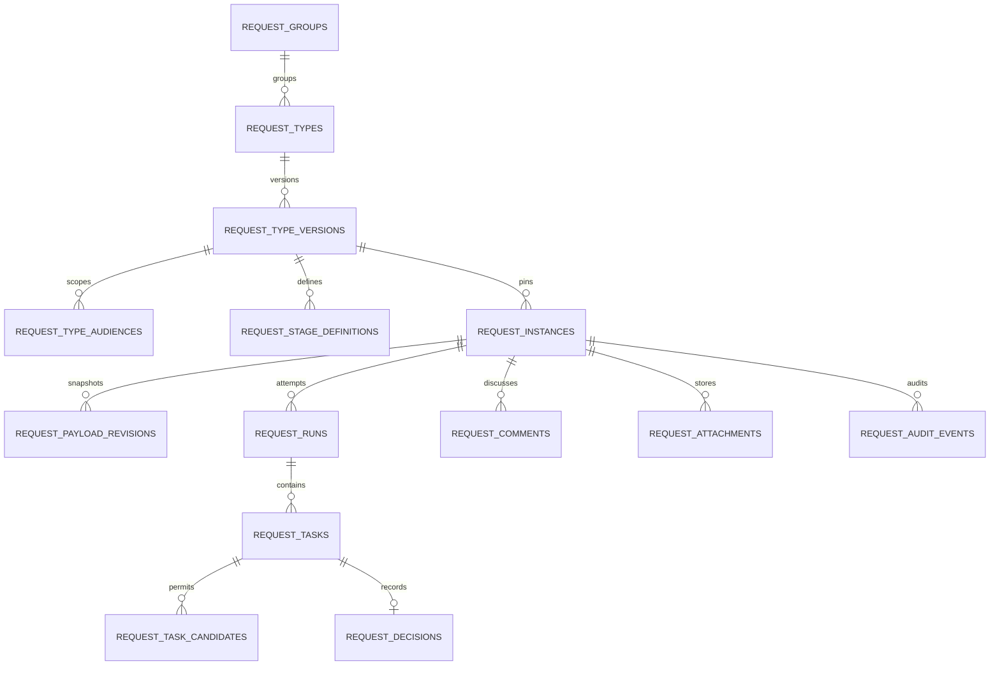

# Database ERD and Schema

## 1. Modeling rules

- Request owns every table below; migrations live only in `Modules/Request`.
- Use repository-standard primary keys plus public ULIDs for externally addressed records.
- Foreign keys enforce Request-owned relations and Shell User/Role identity only where repository conventions support them.
- JSON is used for versioned schema/payload/config snapshots with explicit validators and size limits; it is not an escape hatch for unindexed operational state.
- Dynamic form values are not stored as EAV rows.
- All timestamps are UTC. Evidence records are retained; archive/retire flags replace destructive deletion.
- Exact database column types must match the repository database and be finalized in `CREATE_PLAN.md` without weakening the constraints here.

## 2. ERD

Outbox and idempotency records reference aggregates by stable Request-owned type/public ID rather than unrestricted polymorphic classes.

## 3. Definition tables

### 3.1 `request_groups`

Purpose: request catalog grouping.

Key columns:

- `id`, `public_id`
- `code` unique, normalized, immutable after use
- `name`, `description`, `icon_key`, `color_key`, `sort_order`
- `is_active`, `archived_at`
- `created_by`, `updated_by`, timestamps

Indexes: unique `code`, `(is_active, sort_order)`, `archived_at`.

### 3.2 `request_types`

Purpose: stable request-type identity.

Key columns:

- `id`, `public_id`, `request_group_id`
- `code` unique and immutable after first publish
- `name`, `summary`
- `status` (`draft|published|retired`)
- `current_published_version_id` nullable until first publish
- `active_draft_version_id` nullable
- `sort_order`, `available_from`, `available_until`
- `lock_version`
- `created_by`, `updated_by`, `retired_by`, `retired_at`, timestamps

Constraints/indexes: unique `code`; one active draft enforced by service plus supported database constraint; indexes on group/status/order/availability.

### 3.3 `request_type_versions`

Purpose: immutable published configuration snapshot.

Key columns:

- `id`, `public_id`, `request_type_id`
- `version_number` positive monotonically increasing
- `status` (`draft|published|superseded|retired`)
- `title`, `description`, requester guidance
- `form_schema_json`, `policy_json`, `presentation_json`
- `schema_version`, `canonical_checksum`
- `created_from_version_id` nullable
- `published_by`, `published_at`, `retired_by`, `retired_at`
- `created_by`, `updated_by`, timestamps

Constraints/indexes: unique `(request_type_id, version_number)`; unique checksum optional only within type/version semantics; index status/published time. Published rows are write-protected in the domain and tested.

### 3.4 `request_type_audiences`

Purpose: who can discover/create a version.

Key columns:

- `id`, `request_type_version_id`
- `actor_type` (`user|role`)
- `actor_id`
- `capability` (`discover|create`), with create implying discover in policy
- timestamps

Constraint: unique `(request_type_version_id, actor_type, actor_id, capability)`. Actor type is allowlisted, not a PHP morph class.

### 3.5 `request_stage_definitions`

Purpose: ordered approval pipeline stored with the version.

Key columns:

- `id`, `public_id`, `request_type_version_id`
- `stage_key`, `name`, `position`
- `mode` (`single|parallel_all|parallel_any`)
- `resolver_key`, `resolver_config_json`
- `instructions`, `allow_reassignment`
- `created_at`, `updated_at`

Constraints: unique `(request_type_version_id, stage_key)` and `(request_type_version_id, position)`; position positive and contiguous after validation; config bounded and validated by registered resolver.

## 4. Runtime tables

### 4.1 `request_instances`

Purpose: `InternalRequest` aggregate root.

Key columns:

- `id`, `public_id` ULID unique
- `request_number` unique, human-readable
- `request_type_id`, `request_type_version_id`
- `requester_id`
- `status`
- `title_snapshot`, `requester_snapshot_json`
- `current_payload_revision_id` nullable while empty draft
- `current_run_id` nullable
- `lock_version`
- `submitted_at`, `approved_at`, `rejected_at`, `returned_at`, `cancelled_at`, `archived_at`
- `cancelled_by`, `cancellation_reason`
- timestamps

Indexes: `(requester_id, status, updated_at)`, `(request_type_id, status, created_at)`, `(status, updated_at)`, public ID and number uniques. No generic `module_type/module_id` fields.

### 4.2 `request_payload_revisions`

Purpose: immutable normalized form snapshot.

Key columns:

- `id`, `public_id`, `request_instance_id`
- `revision_number`
- `request_type_version_id`
- `payload_json`, `display_snapshot_json`
- `payload_checksum`, `schema_version`
- `source` (`server_draft|submit|resubmit`)
- `created_by`, `created_at`

Constraints: unique `(request_instance_id, revision_number)` and checksum/index as justified. Payload and display snapshot have explicit byte/depth/field limits.

### 4.3 `request_runs`

Purpose: one submission/resubmission approval attempt.

Key columns:

- `id`, `public_id`, `request_instance_id`
- `sequence_number`
- `request_type_version_id`, `request_payload_revision_id`
- `status`
- `current_stage_position` nullable when terminal
- `started_by`, `started_at`, `completed_at`
- `terminal_reason`, `lock_version`
- timestamps

Constraints: unique `(request_instance_id, sequence_number)`; at most one active run per request enforced transactionally and, where supported, by database constraint; indexes on status/current stage/time.

### 4.4 `request_tasks`

Purpose: runtime decision unit.

Key columns:

- `id`, `public_id`, `request_run_id`, `request_stage_definition_id`
- `stage_key_snapshot`, `stage_name_snapshot`, `stage_position`, `stage_mode`
- `status`
- `assignee_user_id` (one resolved user per task)
- `resolver_key_snapshot`, `resolver_source_snapshot_json`
- `replaces_task_id` nullable, `replaced_by_task_id` nullable
- `activated_at`, `decided_at`, `closed_at`
- `lock_version`, timestamps

Constraints/indexes: one task per `(run, stage_position, assignee_user_id, replacement_generation)` as designed; inbox index `(assignee_user_id, status, activated_at)`; run/stage/status index.

### 4.5 `request_task_candidates`

Purpose: explicit candidate evidence, even though one task is assigned to one user in v1.

Key columns:

- `id`, `request_task_id`, `user_id`
- `source_type` (`fixed_user|role_member|form_user_field|reassignment`)
- `source_reference`, `user_snapshot_json`
- `is_effective`, `created_at`

Constraint: unique `(request_task_id, user_id)`. This table must not be recomputed from current role membership for history.

### 4.6 `request_decisions`

Purpose: immutable business decision.

Key columns:

- `id`, `public_id`, `request_task_id`, `request_run_id`, `request_instance_id`
- `decision` (`approve|reject|return`)
- `actor_user_id`, `effective_actor_user_id`
- `reason`, `context_snapshot_json`
- `idempotency_key_hash`, `correlation_id`
- `decided_at`, `created_at`

Constraint: unique `request_task_id` for terminal business decision; unique scoped idempotency reference as applicable. No update/delete business path.

## 5. Collaboration and evidence tables

### 5.1 `request_comments`

- `id`, `public_id`, `request_instance_id`, optional `request_run_id`
- `author_id`, `body`, `body_format` allowlisted (plain text/approved markdown only)
- optional `redacted_at`, `redacted_by`, `redaction_reason`
- `created_at`

Indexes: request/time and author/time. Normal user editing/deletion is not supported.

### 5.2 `request_attachments`

- `id`, `public_id`, `request_instance_id`, optional payload field key/comment link
- `uploaded_by`, `storage_disk`, opaque `storage_path`
- original safe filename, generated filename, MIME, extension, size, checksum
- `classification`, `scan_status`, `scan_metadata_json`
- `created_at`, optional quarantined/removed metadata

Never persist a public URL. Index request/field/time and checksum where useful.

### 5.3 `request_audit_events`

- `id`, `public_id`, `request_instance_id` nullable for definition events
- `aggregate_type` allowlisted (`request_type|request_instance|request_task|export|operation`)
- `aggregate_public_id`, `event_key`
- actor/effective actor IDs, structured safe delta/context JSON
- reason, correlation ID, idempotency key hash, request metadata allowed by policy
- `occurred_at`, `created_at`

Append-only. Index aggregate/time, instance/time, actor/time, event/time. Audit context excludes secrets and unbounded/raw payload dumps.

## 6. Reliability tables

### 6.1 `request_outbox_messages`

- `id`, `public_id`, `event_key`, `aggregate_type`, `aggregate_public_id`
- `payload_json` with version and minimal safe data
- `correlation_id`, `available_at`
- `attempt_count`, `last_error_code`, `last_error_at`
- `dispatched_at`, `failed_at`, timestamps

Business rows and outbox append share a transaction. Delivery metadata may update; event identity/payload is immutable.

### 6.2 `request_idempotency_keys`

- `id`, actor ID, command key, aggregate public ID, key hash
- request fingerprint hash
- status (`processing|completed|failed_retryable`)
- safe response code/reference JSON
- correlation ID, locked/expiry/completed timestamps

Unique `(actor_id, command_key, aggregate_public_id, key_hash)`. Raw keys and sensitive responses are not stored. Cleanup honors retention and active-processing safety.

## 7. Optional delivery/export records

If repository primitives do not already own them, `CREATE_PLAN.md` may justify Request-owned `request_export_jobs` and `request_notification_deliveries`. They may track generation/delivery state only and cannot become an alternate source of business truth. Do not create duplicate tables when Shared/system infrastructure already supplies a stable contract.

## 8. Request number allocation

Format should be human-readable, for example `REQ-2026-000001`, but exact policy is configuration. Allocation must be transaction-safe and not rely on `MAX()+1`. `CREATE_PLAN.md` must choose a repository-compatible allocator/sequence and prove concurrent uniqueness. Public API addressing uses ULID, not the guessable display number alone.

## 9. JSON contracts

Every JSON column has:

- a documented schema/version;
- maximum bytes, nesting depth, collection length, and string length;
- server-side canonicalization before checksum;
- rejection of unknown keys unless explicitly forward-compatible;
- safe database casting and redaction policy;
- migration/upcaster strategy for read compatibility.

Sensitive field classification controls display, audit delta, notification, export, and offline cache. Never index secrets into search text.

## 10. Query/index acceptance

`CREATE_PLAN.md` must include explain-plan or query-count verification for:

- My Requests by requester/status/time.
- Inbox by assignee/status/time with request/type summary.
- Admin type/version list.
- Request detail with bounded eager-loaded current run/tasks and paginated history/comments.
- Reports by type/status/date without loading payload JSON for every row.
- Outbox/operations by failure state/availability.

No page may trigger per-row role membership, candidate, comment count, attachment count, or current-stage queries.
