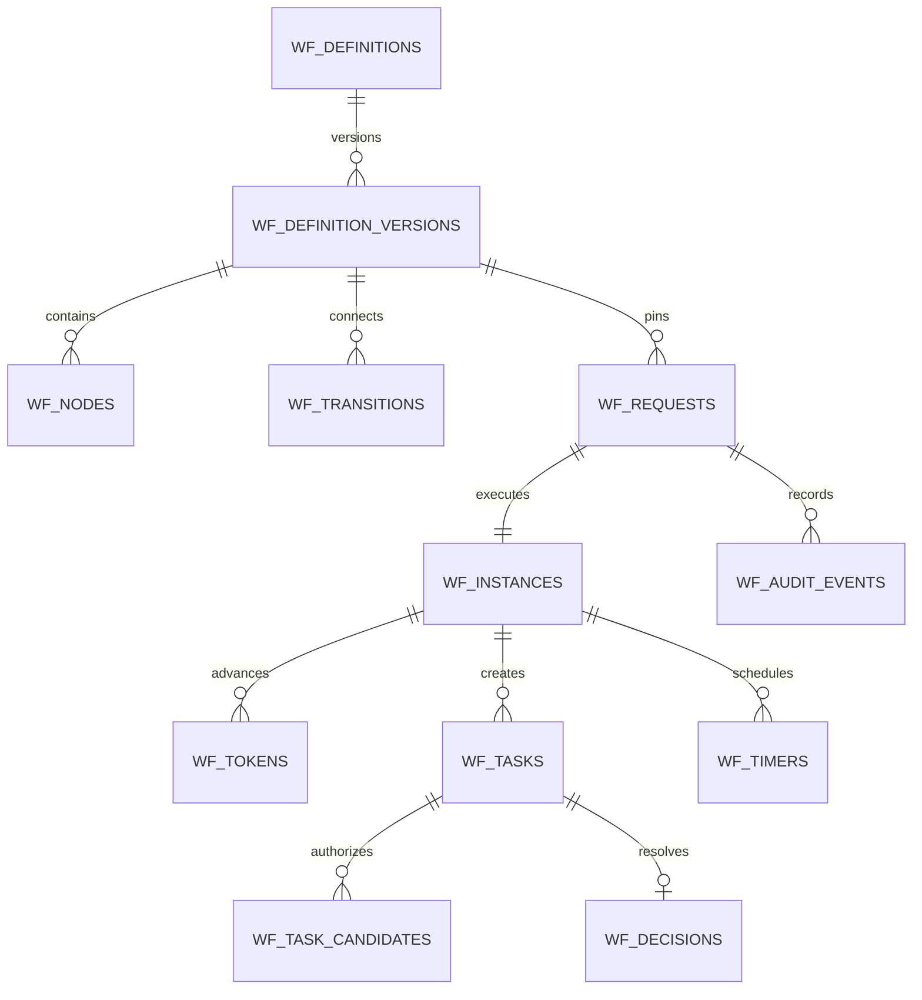

# Database ERD and Schema Contract

> **DEFERRED — Request-first.** Retained as future analysis only; see `docs/modules/Request/ADR-001-REQUEST-FIRST-WORKFLOW-DEFERRED.md`. Do not create these tables while the ADR is active.

## 1. Naming and database rules

- Prefix Workflow-owned tables with `wf_`.
- Use bigint unsigned primary keys unless repository conventions choose ULIDs globally; expose non-sequential public IDs separately.
- Use UTC timestamps and nullable timestamps only for states where absence is meaningful.
- Use decimal for money, never float.
- JSON columns require application schema validation, canonicalization, and size limits.
- Use foreign keys for owned relationships and canonical shell identities when the repository supports them.
- Do not create foreign keys or references to domain-module tables.
- Index real inbox, status, timer, audit, and outbox access paths.

## 2. Relationship overview

The full schema also includes forms, comments, attachments, delegations, outbox messages, and idempotency records.

## 3. Definition tables

### wf_definitions

Key columns:

- id
- public_id unique
- code unique
- name, description, category
- owner_user_id nullable
- current_draft_version_id nullable
- current_published_version_id nullable
- status
- is_active
- created_by, updated_by
- timestamps, soft delete only if no referenced versions/instances are affected

Indexes: category/status, owner/status, active/name.

### wf_definition_versions

- id
- definition_id FK
- version_number
- status
- form_schema JSON
- workflow_policy JSON
- graph_checksum char(64)
- schema_checksum char(64)
- validation_report JSON nullable
- published_at, published_by nullable
- retired_at, retired_by nullable
- created_by, timestamps

Constraints: unique `(definition_id, version_number)`; published content immutable; checksum fields required on publish.

### wf_nodes

- id
- definition_version_id FK
- node_key
- type
- name
- configuration JSON
- ui_position JSON nullable
- sort_order
- timestamps

Constraints: unique `(definition_version_id, node_key)`; type allowlisted; configuration validated per node type.

### wf_transitions

- id
- definition_version_id FK
- transition_key
- from_node_key
- to_node_key
- priority
- is_default
- condition JSON nullable
- label nullable
- timestamps

Constraints: unique version/key; one default per source where required; indexed by version/from/priority. Foreign consistency between node keys is enforced in validation and, if practical, surrogate FK design.

## 4. Request and execution tables

### wf_requests

- id
- public_id unique
- request_no unique
- definition_id FK
- definition_version_id FK
- requester_user_id FK to canonical user identity
- title
- status
- payload JSON
- payload_checksum
- submitted_at, completed_at, rejected_at, returned_at, recalled_at, cancelled_at nullable
- current_revision unsigned integer
- created_by, updated_by
- timestamps, soft deletes only for eligible drafts

Indexes: requester/status/updated, definition/status/created, status/submitted, request_no.

### wf_instances

- id
- public_id unique
- request_id unique FK
- definition_version_id FK
- parent_instance_id nullable FK
- parent_node_key nullable
- status
- context JSON
- lock_version unsigned integer
- started_at, ended_at, failed_at nullable
- failure_code/message_redacted nullable
- correlation_id
- timestamps

Indexes: status/updated, parent, correlation.

### wf_tokens

- id
- instance_id FK
- token_key
- parent_token_id nullable FK
- node_key
- branch_key nullable
- status
- activation_key
- arrived_at, consumed_at, waiting_until nullable
- lock_version
- metadata JSON nullable
- timestamps

Constraints: unique `(instance_id, token_key)` and unique activation semantics such as `(instance_id, activation_key)`.

### wf_join_arrivals

- id
- instance_id FK
- join_node_key
- split_activation_key
- incoming_transition_key
- token_id FK
- arrived_at

Constraint: unique join/activation/incoming/token semantics so retries cannot double-count quorum.

## 5. Work-management tables

### wf_tasks

- id
- public_id unique
- request_id FK
- instance_id FK
- node_key
- activation_key
- type
- name, instructions nullable
- status
- assignment_policy JSON
- quorum_group_key nullable
- claimed_by_user_id nullable
- claimed_at nullable
- due_at, escalated_at, completed_at, cancelled_at, expired_at nullable
- lock_version
- created_at, updated_at

Indexes: status/due, claimed/status, request/status, instance/node/status.

### wf_task_candidates

- id
- task_id FK
- candidate_type: user or role
- candidate_id
- resolved_user_id nullable
- resolver_key
- resolution_snapshot JSON
- eligible_from, eligible_until nullable
- created_at

Unique/index design must prevent duplicate candidate snapshots and support inbox queries by user and role. Candidate IDs must reference only shell-owned identity/role sources.

### wf_task_assignments

- id
- task_id FK
- user_id
- assignment_type
- source_candidate_id nullable
- delegated_from_user_id nullable
- assigned_by_user_id nullable
- reason nullable
- active_from, active_until nullable
- revoked_at nullable
- timestamps

### wf_decisions

- id
- public_id unique
- task_id unique FK for single-terminal task policy
- request_id, instance_id
- actor_user_id
- acting_for_user_id nullable
- outcome
- reason/comment nullable
- request_revision
- idempotency_key
- decided_at
- metadata JSON nullable

Constraints: unique idempotency scope and one terminal decision per task.

### wf_delegations

- id
- delegator_user_id
- delegate_user_id
- scope_type and scope_data JSON
- starts_at, ends_at
- status
- reason
- created_by, revoked_by nullable
- created_at, updated_at, revoked_at nullable

Prevent self-delegation, invalid intervals, overlapping duplicate scope, and delegation chains beyond configured depth.

## 6. Collaboration and time

### wf_comments

- id, public_id
- request_id FK
- task_id nullable FK
- author_user_id
- body
- visibility enum (`participants`, `requester`, `operators`) unless CREATE_PLAN simplifies it
- edited_at/deleted_at nullable with audit
- timestamps

### wf_attachments

- id, public_id
- request_id FK
- comment_id/task_id nullable
- uploaded_by_user_id
- disk, storage_key (server-generated), original_name, mime_type, size_bytes, checksum
- scan_status and scan_metadata nullable
- retention_until nullable
- timestamps, soft delete with audit

Never store client paths or public URLs as authority.

### wf_timers

- id
- instance_id/request_id/task_id nullable FKs
- timer_key
- type
- due_at
- status
- attempt_count
- lease_owner/leased_until nullable
- fired_at/cancelled_at nullable
- payload JSON bounded
- timestamps

Constraints: unique timer key per activation; indexes status/due and leased_until.

## 7. Reliability and evidence

### wf_audit_events

- id, public_id
- occurred_at
- actor_user_id nullable for system actor
- impersonator_user_id nullable
- action
- aggregate_type allowlisted
- aggregate_id
- request_id nullable
- before_state/after_state nullable
- metadata JSON redacted
- correlation_id, causation_id
- ip_hash/ip_address according to approved privacy policy
- user_agent_hash nullable
- previous_hash/event_hash optional tamper-evident chain

Indexes: request/time, aggregate/time, actor/time, action/time, correlation.

Application code provides no update/delete path. Database retention/archival is a privileged operational procedure.

### wf_outbox_messages

- id UUID/public event ID
- topic allowlisted
- aggregate_type/id
- payload JSON
- status
- available_at
- attempt_count
- locked_by/locked_until nullable
- delivered_at nullable
- last_error_code/redacted_message nullable
- correlation_id/causation_id
- timestamps

Indexes: status/available, locked_until, aggregate, topic.

### wf_idempotency_records

- id
- actor_user_id nullable
- scope
- idempotency_key
- request_fingerprint
- status
- response_code
- response_snapshot JSON bounded/redacted
- resource_type/id nullable
- expires_at
- timestamps

Constraint: unique actor/scope/key. Reuse with a different fingerprint returns conflict.

## 8. Optional projection tables

Inbox/reporting projections may be added only if query budgets prove necessary. They must be rebuildable from source tables/outbox and never become the authoritative workflow state.

## 9. Migration and rollback expectations

- Create tables in dependency order and drop in reverse order.
- Fresh MySQL migration is mandatory; SQLite test compatibility is evaluated, not assumed.
- Seed only deterministic system catalogs/templates approved in CREATE_PLAN.
- Never modify another module's migrations.
- Rollback must not delete data from shell/domain modules.
- Large future schema changes use additive migrations and backfills, not historical rewrites.
